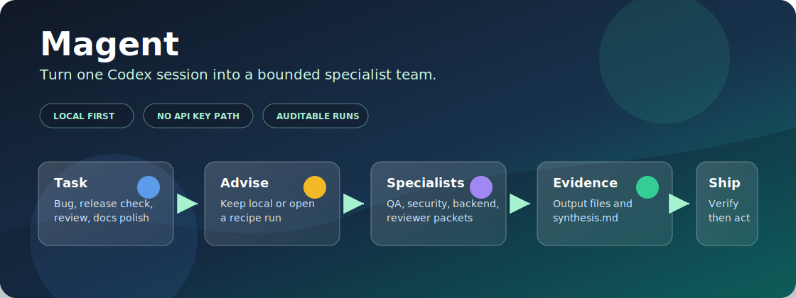
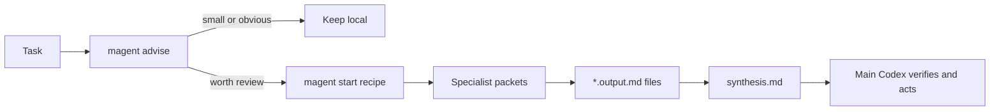

<p align="center">
  
</p>

<h1 align="center">Magent: Codex Multi-Agent Orchestration</h1>

<p align="center">
  <strong>One Codex session. Clear specialist roles. Local evidence you can inspect.</strong>
</p>

<p align="center">
  <a href="LICENSE"></a>
  <a href=".github/workflows/ci.yml"></a>
  
  
  
</p>

Magent is a source-first toolkit for running disciplined multi-agent workflows
inside a normal Codex session.

It does not call an external model API in the default path. Instead, it turns a
task into a local, auditable set of specialist prompt packets, output files, and
synthesis steps. The main Codex session stays in charge of final decisions,
edits, verification, and user communication.

## At A Glance

| Signal | What it means |
| --- | --- |
| Compass signal | `magent advise` tells you whether the task is worth opening subagents. |
| Recipe shelf | Start useful workflows for bugfix, review, release, docs, and tests. |
| Specialist packets | Each specialist gets a bounded copyable prompt and output file. |
| Evidence trail | Results merge into `synthesis.md`; the main agent still decides. |
| Guardrails | Generated runs, caches, binaries, and private task data stay out of Git. |

## Why This Exists

Large engineering tasks often need more than one perspective:

- a backend engineer to reason about API contracts
- a QA engineer to design regression checks
- a security reviewer to inspect trust boundaries
- a docs reviewer to catch onboarding gaps
- a release reviewer to decide whether the project is actually shippable

Doing that informally in one long chat is easy to blur. Magent makes the roles,
scope, handoffs, and evidence explicit.

The project is intentionally practical: it includes ready-made recipes for bug
fixing, code review, release readiness, documentation polish, and test planning.
It also includes `magent advise`, a zero-write preflight that tells you whether
opening a multi-agent run is worth the manual overhead.

## The Shape Of A Run



## Current Status

This repository is ready to publish as a source project.

- Maturity audit: `publishable`
- Test suite: 55 pytest tests
- Runtime model: local, Codex-only, manual execution
- License: MIT
- Normal operation: no OpenAI, Anthropic, or third-party model API key required

The honest limitation: Magent has dogfood evidence and regression tests, not a
large benchmark proving that subagents improve every task. Use it when
independent review can catch real risk. Keep tiny edits local.

## What It Does

Magent helps you:

- decide whether a task should stay local or use subagents
- start a practical workflow from a recipe
- route work to bounded specialist identities
- generate copyable prompt packets for each specialist
- track manual completion with output files
- merge specialist outputs into `synthesis.md`
- keep generated run folders out of source commits
- verify publish readiness with one command

## When To Use It

Use Magent for:

- bugs with uncertain root cause
- auth, security, payment, migration, or production-risk work
- cross-module changes where one pass may miss interactions
- pre-merge code review of generated or refactored code
- release readiness checks
- documentation and onboarding reviews
- test plan design for risky changes

Do not use Magent for:

- typos
- formatting-only edits
- obvious one-line changes
- tasks where an independent reviewer cannot change the outcome

Run `magent advise` first when unsure.

## Quick Start

Use Python 3.10 or newer.

```bash
python -m venv .venv
python -m pip install --upgrade pip
python -m pip install -r requirements-dev.txt
python scripts/verify.py
```

Ask whether a task is worth a multi-agent run:

```bash
python .agents/magent.py advise --scope "src/auth tests/auth" --task "login returns 500 after password reset"
```

List practical recipes:

```bash
python .agents/magent.py recipes
```

Start a bugfix workflow:

```bash
python .agents/magent.py start bugfix --scope "src/auth tests/auth" --task "login returns 500 after password reset"
```

Show the next pending specialist packet:

```bash
python .agents/magent.py step latest
```

Generated runs live under `.agents/reports/runs/RUN_ID/` and are ignored by
Git by default.

## Example Output

For a risky auth bug, `magent advise` can recommend a recipe and show the cost:

```text
Recommendation: use-recipe
Recipe: bugfix
Pattern: critic-loop
Identities: backend-api-engineer, qa-test-automation-engineer, security-engineer, code-reviewer

Estimated overhead:
- Agent packets: 4
- Output files: 4
- Sync needed: true
- Merge needed: true
```

For a tiny copy edit, it should tell you to keep the work local:

```text
Recommendation: keep-local
Identities: none
Task looks small or low-risk; manual orchestration likely costs more than it saves.
```

## Workflow

1. Run `advise` to estimate whether orchestration is worth it.
2. Choose a recipe with `recipes`.
3. Create a run with `start RECIPE` or `run`.
4. Use `step` to print the next pending specialist packet.
5. Paste the packet into the current Codex session and answer as that bounded role.
6. Save the answer into the matching `AGENT_ID.output.md` file.
7. Run `step` again until all agents are complete.
8. Run `merge-results.py` to build `synthesis.md`.
9. Let the main Codex session decide what to implement and verify.

The generated specialist outputs are evidence, not final authority.

## Main Commands

```bash
python .agents/magent.py
python .agents/magent.py advise --scope "src tests" --task "..."
python .agents/magent.py recipes
python .agents/magent.py recipes bugfix
python .agents/magent.py start bugfix --scope "src tests" --task "..."
python .agents/magent.py run --task "..." --scope "..."
python .agents/magent.py step latest
python .agents/magent.py status latest
python .agents/magent.py sync latest
python .agents/magent.py list
python .agents/magent.py agents
python .agents/magent.py ui --no-browser
python scripts/doctor.py
python scripts/maturity_audit.py
python scripts/verify.py
python scripts/clean.py --runs --apply
```

`step` is the normal loop command. `sync` remains available as a lower-level
refresh command.

## Recipes

| Recipe | Use it for | Output |
| --- | --- | --- |
| `bugfix` | root-cause-focused bug work | patch plan and regression checks |
| `code-review` | pre-merge review | severity-ordered findings |
| `release-readiness` | ship/no-ship checks | blockers, warnings, verification evidence |
| `docs-polish` | onboarding and command accuracy | documentation improvement plan |
| `test-plan` | targeted test design | prioritized verification plan |

## Repository Layout

```text
.agents/
  magent.py        CLI entry point
  identities/      specialist identity cards
  presets/         reusable team presets
  recipes/         practical workflow recipes
  reports/runs/    ignored local run folders
  scripts/         routing, execution, dashboard, and validation helpers
  skills/          Codex skills for routing and orchestration
  ui/              local dashboard
  workflows/       reusable workflow definitions
docs/              setup, user, architecture, evidence, and release docs
scripts/           repository-level doctor, audit, verify, and cleanup helpers
tests/             regression tests
```

## Verification

Run the full local gate:

```bash
python scripts/verify.py
```

It runs:

- project doctor
- maturity audit
- identity validation
- pytest suite
- CLI smoke test

Clean generated artifacts before publishing or packaging:

```bash
python scripts/clean.py --runs --apply
```

## Documentation

- [Getting started](docs/GETTING_STARTED.md)
- [User guide](docs/USER_GUIDE.md)
- [Architecture](docs/ARCHITECTURE.md)
- [Practical recipes](docs/RECIPES.md)
- [Efficiency evidence](docs/EFFICIENCY_EVIDENCE.md)
- [Dogfood report](docs/DOGFOOD_REPORT.md)
- [Maintainer guide](docs/MAINTAINER_GUIDE.md)
- [Maturity audit](docs/MATURITY_AUDIT.md)
- [Release checklist](docs/RELEASE_CHECKLIST.md)
- [Example workflow](EXAMPLE.md)
- [Contributing](CONTRIBUTING.md)

## Safety Model

- Generated agents are bounded evidence producers.
- The main Codex session owns final decisions and completion claims.
- External side effects such as pushing, publishing, deploying, or changing
  third-party resources require explicit user approval.
- Generated run folders, caches, binary builds, and private task data should not
  be committed.
- Do not paste secrets or private production data into public run artifacts.

## GitHub Publishing Notes

This project should be published as source. Do not commit local executables,
PyInstaller output, generated run folders, caches, or private run data.

For binary distribution, build locally from `.agents/` and attach the artifact
to a GitHub Release instead of committing it to the source tree.

## Roadmap

- More paired-run efficiency evidence across task classes
- Better dashboard status for manual runs
- More recipe coverage for frontend, backend, docs, and release work
- Optional integrations for environments that provide real subagent execution

## License

MIT. See [LICENSE](LICENSE).
